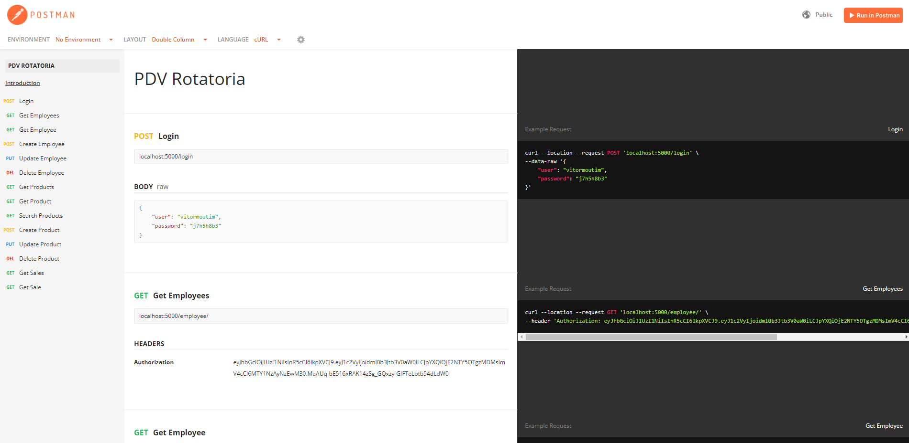

# API RESTful para o ponto de venda da Lachonete Rotatoria 

## Documentação:
[Documentação completa aqui](https://documenter.getpostman.com/view/19292971/UzBtnin7)

## Resumo do projeto

Essa API RESTful foi desenvolvida para ser usado no ponto de venda da Lanchonete Rotatoria. Ela servirá para gerenciar produtos e pedidos realizados via front-end.

## Tecnologias utilizadas

* JavaScript
* Sequelize
* JSON Web Token
* Express

